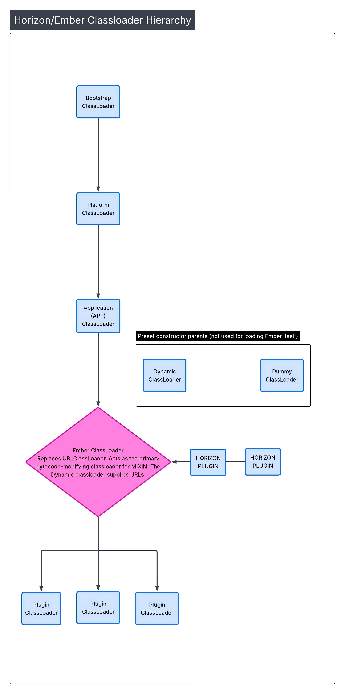

# Horizon

---

## Introduction

Horizon is a MIXIN wrapper for PaperMC servers and forks, expanding plugin capabilities to allow for further
customization and enhancements. Horizon is a project that is intended to supersede
a project by one of the core team members(Dueris), the project Eclipse. Eclipse was a plugin for Paper that allowed
loading SpongePowered Mixins and access wideners and transformers.
This project, of course, came with many issues and drawbacks that made Eclipse hard to work with most of the time. And
so, Dueris archived the project and decided to create Horizon, which is the successor of Eclipse.

Horizon intends to fix the issues from Eclipse and create a more manageable, workable, and stable environment for
plugins to work with, while incorporating plugin authors' ideas in a much more powerful and flexible manner.

Horizon acts more as a replacement wrapper for Paperclip(the launcher for Paper servers and forks). It boots the game in
a very similar way, as it contains an iteration of the Paperclip launcher. Please read the sections below to
learn more about how Horizon works and how to develop with it.

## Breakages and Incompatibilities

Horizon tries not to break much of anything; however, there are some things it's incompatible with.

- **The legacy plugin loader.** The legacy plugin loader(`LegacyPluginLoadingStrategy.java`) is completely unsupported
  in Horizon. This is due to Horizon having a few internal
  mixin injections to the `ModernPluginLoadingStrategy.java` file, and just supporting the legacy format is not in the
  scope of development ATM, as people should be using the
  modern plugin loading strategy. To ensure you are using the modern strategy, please ensure your server does not
  contain the startup flag `-Dpaper.useLegacyPluginLoading=true`.
- **UniverseSpigot.** Due to how Universe's loader is set up, Horizon is fundamentally incompatible with Universe. Do
  not ask CanvasMC or Universe for support; it will not work and is not planned to work.
- **Spigot and Bukkit.** Horizon strictly works only for Paper servers and forks, and is untested on Spigot and Bukkit,
  and you will not receive support for using Spigot or Bukkit with Horizon

## How To

### Installation and Running

Horizon is simple to install and get running. You can download Horizon from our website, https://canvasmc.io, and from
there it is as simple as dropping the downloaded JAR file
into the *same directory* as your server JAR. **DO NOT REPLACE THE SERVER JAR!!** Horizon works as an external wrapper
for the server JAR, so the server JAR needs to be present for Horizon
to function correctly. The default file Horizon will search for is `server.jar`, which is configurable wth the
`horizon.yml` configuration file:

```yaml
pluginsDirectory: plugins
serverJar: server.jar
cacheLocation: cache/horizon
extraPlugins: [ ]
serverName: horizon
```

This `horizon.yml` file is intended for more extensive configuration of Horizon, allowing setting the server JAR name,
since not all servers will have their server JAR named `server.jar`, or you can then
have multiple server JARs and swap between the target Horizons they use.

- The `cacheLocation` is simply for storing JIJ plugins and such, and is cleared on each boot of Horizon. We don't
  recommend changing it, but
  you can if there are conflicts or some issue arises, and you need to change the location.
- The option `extraPlugins` allows for adding additional plugins to the Horizon classpath to be loaded. Horizon also
  reads from the `--add-plugin` JVM argument that is passed to the server
- The `serverName` option is an optional override for the server mod name, as it gets overridden in Horizon
  automatically by its internal mixin inject
- The `pluginsDirectory` option should always point to your plugins directory for both Paper plugins and Horizon
  plugins; however, you can separate them if you need or want to.

Once all options are configured to your liking, you can boot the Horizon JAR as usual, and your server will run with
Horizon as its bootstrapper!

> [!NOTE]
> You can disable internal mixin injections by using flags like `-DHorizon.disable.mixin.{mixin package location}`

### Basics of Developing a Horizon Plugin

Developing with Horizon is *generally* simple. One tool you can use is the Gradle plugin, which is described in more
detail below. To start with, developing a Horizon plugin,
you need to add a few more things to your plugin YML. You need something like this:

```yaml
horizon:
  mixins:
    - "mixins.test.json"
  wideners:
    - "wideners.at"
    - "additional_wideners.at"
  load-datapack-entry: true
```

Horizon reads from the `plugin.yml` or `paper-plugin.yml` from the plugin JAR entries to build the `ObjectTree`
representing your plugin configuration.
Each option in the `horizon` field is optional; the only required field is `horizon` for your plugin to be marked and
loaded by Horizon.

- `mixins` - This is a `String[]` option that defines the SpongePowered mixin configuration files in your plugin
  artifact. Like if it were `test.mixins.json`, the entry should be in the root of your resources, named
  `test.mixins.json`
- `wideners` - This is the same as the `mixins` field, but defines Forge access transformers for your plugin. The team
  initially wanted to use Fabric wideners, but to keep consistency with Paper's
  build system and paperweight, we decided it would be best to use transformers instead. You can find detailed
  documentation regarding Forge access transformers [here](#mixins-and-ats)
- `load-datapack-entry` - This is just a `boolean` option, `false` by default, that defines if your plugin should be
  loaded as a datapack entry too, similar to how the Fabric loader loads mods as datapacks too. While somewhat useless
  in more modern versions
  of the game due to Papers lifecycle API, this introduces a more direct way to load your plugin as a datapack, and also
  supports the `/minecraft:reload` command to reload your plugin datapack assets

> [!NOTE]
> More information on Mixins and ATs is available in the [Mixins && ATs](#mixins-and-ats) section below.

To check if your plugin is loaded as a Horizon plugin successfully, you can read the plugin data tree in the startup
logs, which will look similar to this:

```terminaloutput
[23:23:34] [INFO]: Found 2 plugin(s):
        - horizon local
        - testplugin 1.0.0-SNAPSHOT
```

> [!NOTE]
> You can enable debug logging for Horizon with `-DHorizon.debug=true`

Another way is by checking the `/plugins` command, which is replaced with the Horizon internal mixins to include Horizon
plugins.


You can learn about how to use our Gradle plugin to assist in Horizon plugin development [below](#gradle-plugin), along
with [JIJ](#jijjar-in-jar). It is also recommended to familiarize yourself with the new classloader hierarchy in
the [New Classloading Tree](#new-classloading-tree) section

### JIJ(JAR In JAR)

Another capability Horizon plugins have is JIJ(JAR In JAR). JIJ is a feature that allows Horizon plugins to attach
Horizon plugins, Paper plugins, or external libraries.
All JIJ plugins will be loaded from the `horizon.yml:cacheLocation` configured location, which is fetchable via Horizons
API, which is documented [below](#horizon-plugin-api).
All Paper plugins will be loaded as usual, and their plugin data folders will remain in the same place. Horizon plugins
will function exactly the same, and will load
mixins like normal. External libraries will be appended to the game classpath with Ember, as if they were libraries
added by the server JAR, and will be accessible after Horizon launches the game.

### Gradle Plugin

In order to start developing plugins for Horizon, it is required that you use the `horizon` gradle plugin in your build
scripts together with the `weaver-userdev` plugin. The `horizon` plugin automatically applies your ATs to the server
JAR your plugin is going to be developed against, allowing you to compile against it and access the server's internals,
and the `userdev` plugin allows it to achieve all that.

Below is shown an example `build.gradle.kts` configuration structure to give you an idea on how to start developing!

```kotlin
plugins {
    id("io.canvasmc.weaver.userdev") version "xxx"
    id("io.canvasmc.horizon") version "xxx"
}

dependencies {
    horizon.horizonApi("1.0.0") // <- required for accesing the Horizon API in dev.
    paperweight.paperDevBundle("1.21.11-R0.1-SNAPSHOT")
}

horizon {
    accessTransformerFiles.from(
        file("src/main/resources/wideners.at"),
        file("src/main/resources/additional_wideners.at"),
    )
}
```

In addition, using the `shadow` gradle plugin is *unsupported* and you should instead opt-in to JiJ'ing your
dependencies by using the appropriate configurations, just like this:

```kotlin
dependencies {
    includeMixinPlugin("io.canvasmc:nice-horizon-plugin:1.0.0")
    includePlugin("io.canvasmc:nice-plugin:1.0.0")
    includeLibrary("io.canvasmc:nice-library:1.0.0")
}
```

The above configurations define in what directory the dependency is going to be placed in the JAR file structure, their
names are pretty intuitive in themselves, however each one is described in detail below anyway.

For a Horizon-based plugin dependency, the appropriate configuration is `includeMixinPlugin`, which puts it under
`META-INF/jars/horizon`.

For a normal plugin dependency, aka not-horizon, you should use the `includePlugin` configuration, which places it under
`META-INF/jars/plugin`.

And finally, for a library, the configuration to use is `includeLibrary`, which places it under `META-INF/jars/libs`.

All of those dependencies will be loaded at the server startup, for a more detailed overlook refer to
the [JIJ](#jijjar-in-jar) section.

## New Classloading Tree

For obvious reasons, the classloading hierarchy tree has changed. A diagram is shown below with a general visual example
of what this looks like



Paper (and forks) is similar to this tree; however, Ember is replaced with a normal `URLClassLoader`. The `DYNAMIC`
classloader shown in the diagram
is a `URLClassLoader` instance that allows modification of the URLs added to it post-init. Horizon plugins, instead of
being loaded with every other
plugin in their own classloader, are linked to the Ember classloader. This **does** mean that Horizon plugins **cannot**
invoke code in non-Horizon plugins.

One way to get around this is by using an abstraction layer and a 2nd plugin. You could have a Paper plugin and a
Horizon plugin loaded(using JIJ too for more compact file managing) and create interfaces in the Horizon plugin that
the Paper plugin implements, of which the Paper plugin will then access code in other non-Horizon plugin JARs.
By implementing a system like this, you could create a Horizon plugin that can communicate with other Paper plugins.
Do note, though, that all Horizon plugins are visible to the Paper plugin classloaders.

## ObjectTree API

Horizon uses a powerful data API called the `ObjectTree` API for parsing and managing hierarchical immutable data
structures. OT provides a type-safe way to work with multiple file formats including `JSON`, `YAML`, `TOML`, and
`PROPERTIES`

### Overview

OT is an immutable, thread-safe API that represents file data as a tree structure. It provides mutli-format support,
type-safe conversions, alias support, variable interpolation, custom serialization, multiple reader inputs, and strong
error handling.

### Basic Usage

#### Reading Data

Basic reading of a file is like so:

```java
// Read JSON data
ObjectTree config = ObjectTree.read()
        .format(Format.JSON)
        .from(new FileInputStream("config.json"))
        .parse();

// Access values with automatic type conversion
String serverName = config.getValue("serverName").asString();
int port = config.getValue("port").asInt();
boolean enabled = config.getValue("enabled").asBoolean();

// Access nested structures
ObjectTree database = config.getTree("database");
String host = database.getValue("host").asString();

// Access arrays
ObjectArray plugins = config.getArray("plugins");
for (int i = 0; i < plugins.size(); i++) {
    // Converts each entry in the ObjectArray to a String and prints it
    System.out.println(plugins.get(i).asString());
}
```

#### Reading from JAR Resources

When reading from JAR entries:

```java
// Parsing a plugin metadata for example
try (InputStream stream = jarFile.getInputStream(entry)) {
    ObjectTree metadata = ObjectTree.read()
        .format(Format.YAML)
        .from(stream)
        .parse();
    
    String pluginName = metadata.getValue("name").asString();
    String version = metadata.getValue("version").asString();
}
```

### Type Conversions

OT provides methods for type conversion with automatic validation:

```java
ObjectValue value = config.getValue("key");

// Built-in type conversions
// If unable to convert for any reason, it will throw a TypeConversionException
String str = value.asString();
int i = value.asInt();
long l = value.asLong();
double d = value.asDouble();
float f = value.asFloat();
boolean b = value.asBoolean();
BigDecimal bd = value.asBigDecimal();
BigInteger bi = value.asBigInteger();

// Optional variants (returns empty Optional on failure)
Optional<Integer> maybeInt = value.asIntOptional();
Optional<String> maybeStr = value.asStringOptional();
```

### Custom Type Converters

Register custom converters for your own types:

```java
ObjectTree config = ObjectTree.read()
    .format(Format.JSON)
    // Note: this is for example, both UUID and File are implemented by default
    .registerConverter(File.class, obj -> new File(obj.toString()))
    .registerConverter(UUID.class, obj -> UUID.fromString(obj.toString()))
    .from(inputStream)
    .parse();

File pluginDir = config.getValue("pluginsDirectory").as(File.class);
UUID serverId = config.getValue("serverId").as(UUID.class);
```

### Custom Object Deserialization

For complex objects, register custom deserializers:

```java
// Define your data class
record ServerConfig(String host, int port, boolean ssl) {
}

// Register deserializer
ObjectTree config = ObjectTree.read()
    .format(Format.JSON)
    .registerDeserializer(ServerConfig.class, tree ->
        new ServerConfig(
            tree.getValue("host").asString(),
            tree.getValue("port").asInt(),
            tree.getValueOptional("ssl")
                .map(v -> v.asBoolean())
                .orElse(false)
        )
    )
    .from(inputStream)
    .parse();

// Deserialize directly to your type
ServerConfig server = config.as(ServerConfig.class);
```

> [!NOTE]
> For converting an ObjectTree -> T, register a **deserializer** and use the `ObjectTree#as` method. For converting an
> ObjectValue -> T, register a **type converter** and use `ObjectValue#as` method

### Alias Support

Support multiple key names that map to the same value:

```java
ObjectTree config = ObjectTree.read()
    .format(Format.YAML)
    .alias("host", "db_host", "databaseHost", "dbHost")
    .alias("port", "db_port", "databasePort", "dbPort")
    .from(inputStream)
    .parse();

// This makes it so your YAML file you are parsing can use `db_host`, or `dbHost` in the
// actual YAML file, but when read it is remapped to `host`, to be fetched like below
String host = config.getValue("host").asString();
```

> [!NOTE]
> You cannot access values via nested keys, like "test.example", any attempts will throw a NoSuchElementException

### Variable Interpolation

OT supports variable substitution using `${variable}` syntax:

```java
ObjectTree config = ObjectTree.read()
    .format(Format.YAML)
    .withVariable("region", "us-west-2")
    .from(inputStream)
    .parse();

// YAML file with variables:
// server:
//   endpoint: https://${region}.example.com
//   dataDir: ${env.HOME}/horizon

String endpoint = config.getTree("server").getValue("endpoint").asString();
// Result: "https://us-west-2.example.com"

String dataDir = config.getTree("server").getValue("dataDir").asString();
// Result: "/home/user/horizon" (uses environment variable)
```

Builtin variable sources:

- **Environment variables**: `${env.VARIABLE_NAME}`
- **System properties**: `${sys.property.name}`
- **Custom variables**: Added via `.withVariable()`

### Writing and Optionals

Create and save data programmatically:

```java
// Build an example data structure
ObjectTree config = ObjectTree.builder()
        .put("serverName", "My Server")
        .put("port", 25565)
        .build();

// Write as JSON
try (FileWriter writer = new FileWriter("config.json")) {
    ObjectTree.write(config)
        .format(Format.JSON)
        .to(writer);
}

// Or get as string
String yaml = ObjectTree.write(config)
    .format(Format.YAML)
    .toString();
```

All formats are interchangeable, you can read data in one format and write it in another. There is also safer access
with optionals:

```java
// Get optional values
Optional<ObjectValue> maybeValue = config.getValueOptional("optional-key");
Optional<ObjectTree> maybeTree = config.getTreeOptional("optional-section");
Optional<ObjectArray> maybeArray = config.getArrayOptional("optional-list");

// Chain optionals for safe access
int port = config.getTreeOptional("server")
    .flatMap(server -> server.getValueOptional("port"))
    .map(v -> v.asInt())
    .orElse(25565);
```

## Mixins and ATs

For working with Mixins and ATs, it is *HIGHLY* recommended that you use IntelliJ IDEA with
the [Minecraft Development plugin](https://plugins.jetbrains.com/plugin/8327-minecraft-development).
This plugin will help autofill entries and such that will be extremely useful for development.

### Access Transformers (ATs)

Access Transformers (ATs) are used to widen member visibility and to add or remove the `final` modifier from classes,
methods, and fields. They allow plugin developers to access and modify members that would otherwise be inaccessible.

AT files are parsed line-by-line at startup and applied during class transformation at load time.

> [!NOTE]
> Any text following a `#` character until the end of the line is treated as a comment and will be ignored by the
> parser.

#### Access Modifiers

Each definition begins with an access modifier that defines the *new* visibility of the targeted member. Modifiers are
listed below in decreasing order of visibility:

* `public` — Accessible from all classes, regardless of package
* `protected` — Accessible within the same package and by subclasses
* `default` — Accessible only within the same package
* `private` — Accessible only within the declaring class

In addition, the special suffixes `+f` and `-f` may be appended to any access modifier to respectively **add** or *
*remove** the `final` modifier.

The `final` modifier prevents:

* Subclassing (for classes)
* Method overriding (for methods)
* Field reassignment (for fields)

#### Important Semantics and JVM Constraints

> [!WARNING]
> Access Transformers apply **only** to the exact member they reference. Overriding methods are *not* implicitly
> transformed.
> If a transformed method has an override with more restrictive visibility, the JVM will reject the class and fail to
> load it.
> As a result, only the following categories of methods are generally safe to transform:
> * `private` methods
> * `final` methods (or methods declared in `final` classes)
> * `static` methods

Care should be taken when widening non-final instance methods, especially those that may be overridden.

#### Targeting Elements

#### Classes

To target a class, use the following syntax:

```
<access modifier> <fully qualified class name>
```

Inner classes are referenced by joining the outer and inner class names using `$` as a separator:

```
com.example.OuterClass$InnerClass
```

#### Fields

To target a field:

```
<access modifier> <fully qualified class name> <field name>
```

#### Methods

Methods require a full JVM method descriptor, including parameter and return types:

```
<access modifier> <fully qualified class name> <method name>(<parameter types>)<return type>
```

---

#### Type Descriptors

ATs use standard JVM type descriptors as defined in more technical detail
here - [Java Virtual Machine Specification, SE 8, sections 4.3.2 and 4.3.3](https://docs.oracle.com/javase/specs/jvms/se8/html/jvms-4.html#jvms-4.3.2)

#### Primitive Types

* `B` — `byte`
* `C` — `char` (Unicode character code point in UTF-16)
* `D` — `double`
* `F` — `float`
* `I` — `int`
* `J` — `long`
* `S` — `short`
* `Z` — `boolean`

#### Arrays

* `[` — Indicates one dimension of an array
    * Example: `[[S` represents `short[][]`

#### Reference Types

* `L<class name>;` — Reference type using internal JVM naming
    * Example: `Ljava/lang/String;` represents `java.lang.String`

#### Methods

* `(<params>)<return>` — Method descriptor format
  Example: `(I)Z` — Takes an `int`, returns `boolean`
* `V` — Void return type (only valid as a return type)
  Example: `()V` — No parameters, returns nothing

### Mixins

Horizon comes packaged with the latest **Fabric-SpongePowered Mixin** library and **MixinExtras**. Mixin is the core
package and system included in Horizon, and is the main system plugins can use in Horizon to modify the server
internals.

Mixins allow you to inject, redirect, overwrite, or otherwise modify bytecode of existing classes without directly
patching or forking the upstream server codebase

#### Enabling Mixins in a Horizon Plugin

To enable mixins for a plugin, declare one or more mixin configuration files in your plugin metadata:

```yaml
horizon:
  mixins:
    - "mixins.example.json"
```

Each entry must reference a mixin configuration file packaged in your plugin JAR resources

If the `horizon.mixins` block is present, Horizon will treat the plugin as mixin-capable and process its mixins during
bootstrap.

#### Mixin Configuration File

This is an example of a SpongePowered Mixin configuration file:

```json
{
  "required": true,
  "package": "io.example.myplugin.mixin",
  "mixins": [
    "ExampleMixin",
    "AnotherExampleMixin"
  ]
}
```

#### Important Configuration Fields

- **package**
    - Base Java package containing all mixin classes declared in this configuration.

- **mixins**
    - A list of mixin class names (relative to package) that apply in the Horizon environment.

- **required**
    - If true, Horizon will fail fast if any mixin in this config fails to apply.

#### Writing a Mixin

A basic mixin class looks like the following:

```java

@Mixin(MinecraftServer.class)
public abstract class MinecraftServerMixin {

    @Inject(
        method = "runServer",
        at = @At("HEAD")
    )
    private void horizon$onServerStart(CallbackInfo ci) {
        // injected code here
    }
}
```

The Mixin above injects code into the `MinecraftServer#runServer` method at the `HEAD` of the method. Mixins can target
classes, methods, constructors, and `<client>`.
Horizon bundles MixinExtras with the server, allowing more enhanced and expanded capabilities with Mixin. It is
recommended to read over the Mixin and MixinExtras documentation pages linked below.

Mixins and ATs are very complementary, with ATs modifying the access and finality of fields, methods, and classes, and
Mixins injecting and modifying code in the server.

Due to Horizon plugins and server internals being loaded by the Ember classloader, Mixins can target all server
internals and some library internals. There are however, some restrictions to what places you can inject into.
For example, you cannot inject into Horizon internals, for obvious reasons. The full list of excluded packages is below:

- `io.canvasmc.horizon.*`
    - All Horizon internals, except `io.canvasmc.horizon.inject.*`. This exception allows Horizon’s own internal
      mixin/injection logic to function while protecting the rest of the framework from external mutation.

- `org.tinylog.*`, `org.slf4j.*`, `org.apache.logging.log4j.*`
    - Logging libraries used by Horizon and NMS. Transforming logging frameworks can cause insane issues, and as such is
      prohibited.

- `org.spongepowered.asm.*`, `com.llamalad7.mixinextras.*`
    - SpongePowered Mixin core implementation and MixinExtras. Transforming Mixin itself is unsafe and will almost
      certainly break class transformation.

Horizon plugins **cannot** transform classes in non-Horizon plugins due to classloader constraints. Horizon plugins
**CAN** transform classes by other Horizon plugins, and packages not excluded by Horizon.

> [!NOTE]
> There is a `remap` field in the injection annotations, this does *nothing* in Horizon.

#### Mixin and MixinExtras Technical Writeup Documentation

- [SpongePowered Mixin Documentation](https://github.com/SpongePowered/Mixin/wiki)
- [MixinExtras Documentation](https://github.com/LlamaLad7/MixinExtras/wiki)

## Horizon API

Horizon includes API for Horizon plugins to interact with to better understand its environment and other plugins in the
server. This part of the documentation is still a WIP, as there is more API being planned, and more API to document.

### Paperclip API

Horizon implements a way to view Paperclip version metadata, which contains Minecraft version info, pack info, etc.
Currently, Horizon exposes the Paperclip version info and pack info, which can be obtained and used quite simply:

```java
// Here is an example of how to fetch the Horizon instance and read server version information
// Note: there are *many* more methods, and it is best to look at the Javadocs for each class aswell
Horizon horizon = Horizon.INSTANCE;
FileJar paperclip = horizon.getPaperclipJar();

getLogger().info("Paperclip JAR: " + paperclip.ioFile().getName());

PaperclipVersion version = horizon.getPaperclipVersion();

getLogger().info("Minecraft Version: " + version.name());
getLogger().info("Protocol Version: " + version.protocol_version());
getLogger().info("Java Version: " + version.java_version());
getLogger().info("Is stable?: " + version.stable());

PaperclipVersion.PackVersion pack = version.pack_version();
getLogger().info("Pack Version(resources):" + pack.resource_major() + "." + pack.resource_minor());
getLogger().info("Pack Version(data):" + pack.data_major() + "." + pack.data_minor());
```

There may be more things exposed in the future about the Paperclip data, but it is currenly not planned, as it isn't
really something any plugin would need.

### Instrumentation and ClassLoader Exposure

Horizon exposes the JVM Instrumentation that Horizon uses for its booting of the server. It isn't really recommended
to touch the Instrumentation directly, but there are APIs available that do call methods in it, which are more safe to
use and are more recommended for some operations, like appending a jar file to the classloader.

```java
// Gets the MixinLaunch instance, which contains the classloader,
// and other more advanced API like class transformers
MixinLaunch launcher = MixinLaunch.getInstance();

// This contains data like the String[] args that will be passed to the server
// along with inital game connections, and the actual game jar
MixinLaunch.LaunchContext launchContext = launcher.getLaunchContext();

// This is the JVM Instrumentation that can be accessed for doing more advanced operations
// although, it is recommended to use any API provided by Horizon that functions
// similarly or as a replacement to the API that the Instrumentation provides, as it will
// function safer and better for the Horizon environment
java.lang.instrument.Instrumentation instrumentation = JvmAgent.INSTRUMENTATION;

// This is the Ember ClassLoader, which is the primary bytecode modification
// loader for the Horizon environment. Here you can append new jars to the classpath too!
EmberClassLoader classLoader = launcher.getClassLoader();
classLoader.tryAddToHorizonSystemLoader(Paths.get("test.jar"));
```

The code above is a brief showcase of some things you can access and do with the Instrumentation and ClassLoader exposure.
If you want more information on how Instrumentations work, it is linked below:

- [Instrumentation JavaDocs](https://docs.oracle.com/en/java/javase/21/docs/api/java.instrument/java/lang/instrument/Instrumentation.html)

### Plugin API

Horizon introduces a full plugin API that is exposed for all plugins to access. This allows for numerous things like viewing
what other plugins are on the server, which can be used for dependency declaration(coming soon), incompatibilities, etc.
This API also allows you to view nested data entries and more. All data in each plugin is immutable, and shouldn't be attempted
to be modified.

```java
// Get the Horizon instance
Horizon horizon = Horizon.INSTANCE;
// This includes *all* Horizon plugins, nested and unnested
PluginTree plugins = horizon.getPlugins();
for (HorizonPlugin plugin : plugins.getAll()) {
    // The HorizonMetadata class acts as an object representation of the
    // Horizon plugin yaml file. It contains the name, version, mixins,
    // ats, api version, etc.
    HorizonMetadata metadata = plugin.pluginMetadata();
    getLogger().info("Hello " + metadata.name() + "!");

    // The plugin identifier is the same as the 'name' entry in the metadata
    String id = plugin.identifier();

    // The HorizonPlugin also provides the FileJar instance that is tied
    // to the plugin, and also a FileSystem via HorizonPlugin#fileSystem()
    FileJar file = plugin.file();
    getLogger().info("Path of \"" + id + "\": " + file.ioFile().toPath());
}
```

The plugin API is a useful tool for when trying to get other plugins data, or even your own plugins data.

### Class Transformers API

Horizon contains a ClassTransformer API, which is the primary API that drives Mixins and ATs transformation of ClassNodes.
With this API, soon, plugins can register their own TransformationServices much like the Mixin and AT transformation
services. This API hasn't been fully exposed yet, and is currently only limited to the Mixin and AT transformers, but in
the near future, before the initial release, this API will be fully exposed and documented.
